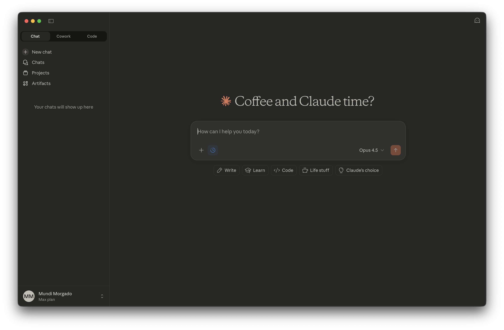
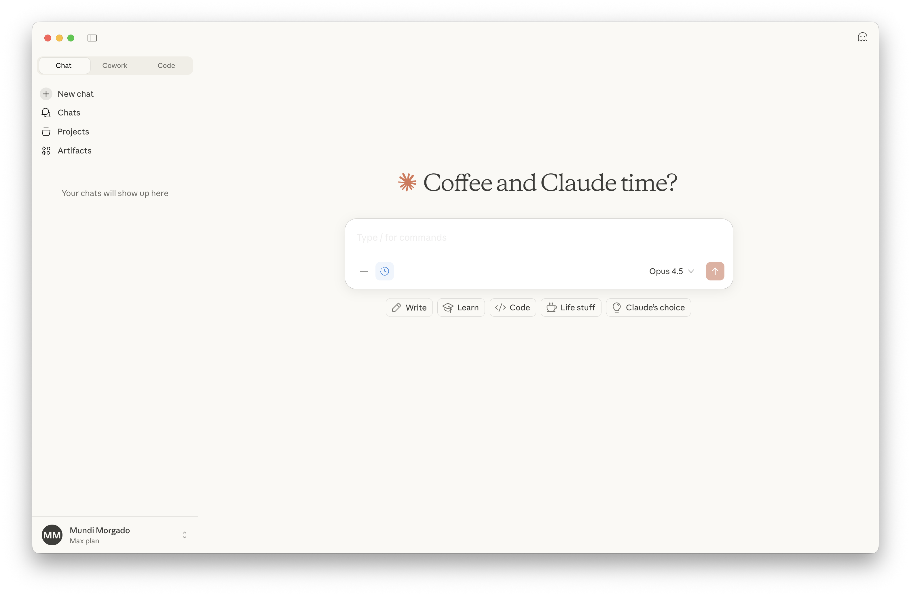

# Claude Theme

A color theme based on Claude's native app UI. Available for VS Code and Ghostty terminal.




## Features

- Color palette extracted from Claude's actual UI
- Light and dark variants
- Consistent colors across VS Code and Ghostty terminal

## Accent Palette

| Role | Hex | Color |
|------|-----|-------|
| Keywords | `#CC7C5E` | Terracotta |
| Strings | `#7A937A` | Sage |
| Functions | `#B38B2D` | Amber |
| Types | `#4A9B92` | Teal |
| Variables | `#9080B0` | Lavender |
| Numbers | `#C08830` | Gold |
| Links | `#4682D5` | Blue |
| Error | `#DC2626` | Red |

## Background Colors

### Light Theme
| Color | Hex | Usage |
|-------|-----|-------|
| Warm Cream | `#FAF9F5` | Main background |
| White | `#FFFFFF` | Cards, inputs |
| Border | `#F0EEE7` | Dividers |
| Primary Text | `#3D3D3A` | Body text |

### Dark Theme
| Color | Hex | Usage |
|-------|-----|-------|
| Charcoal | `#262624` | Main background |
| Elevated | `#30302E` | Cards, panels |
| Deep | `#141413` | Inputs |
| Primary Text | `#C2C0B7` | Body text |

## VS Code Installation

### Option 1: Symlink (recommended for development)

```bash
# macOS/Linux
ln -s /path/to/claude ~/.vscode/extensions/claude

# Windows (PowerShell as Admin)
New-Item -ItemType SymbolicLink -Path "$env:USERPROFILE\.vscode\extensions\claude" -Target "C:\path\to\claude"
```

### Option 2: Copy

```bash
# macOS/Linux
cp -r /path/to/claude ~/.vscode/extensions/

# Windows
xcopy /E /I "C:\path\to\claude" "%USERPROFILE%\.vscode\extensions\claude"
```

### Activate

1. Open VS Code
2. Press `Cmd+K Cmd+T` (macOS) or `Ctrl+K Ctrl+T` (Windows/Linux)
3. Select **Claude Light** or **Claude Dark**

## Ghostty Installation

```bash
# Create themes directory
mkdir -p ~/.config/ghostty/themes

# Copy theme files
cp ghostty/claude-* ~/.config/ghostty/themes/
```

Add to `~/.config/ghostty/config`:

```
# Single theme
theme = claude-dark

# Or auto-switch with system appearance
theme = dark:claude-dark,light:claude-light
```

Restart Ghostty to apply.

## License

MIT License - see [LICENSE](LICENSE) for details.
